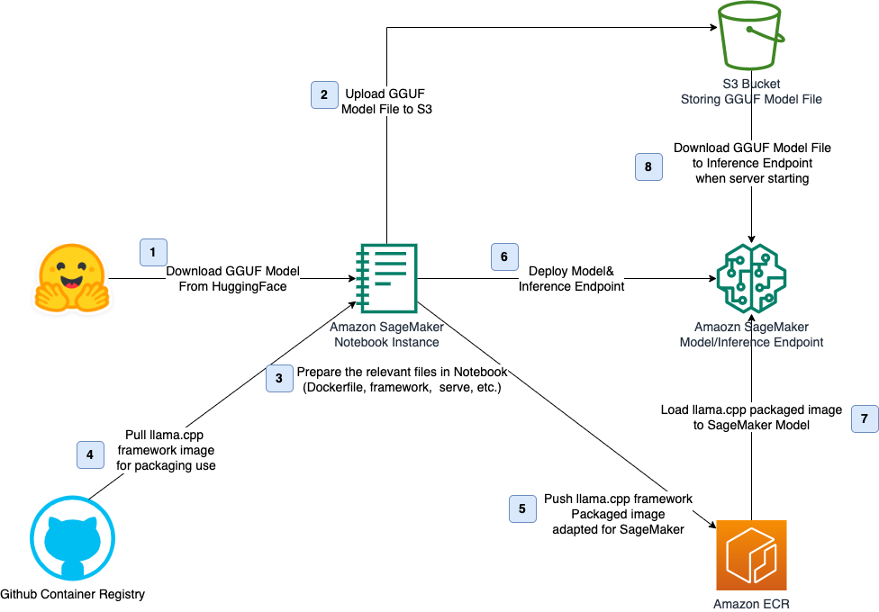
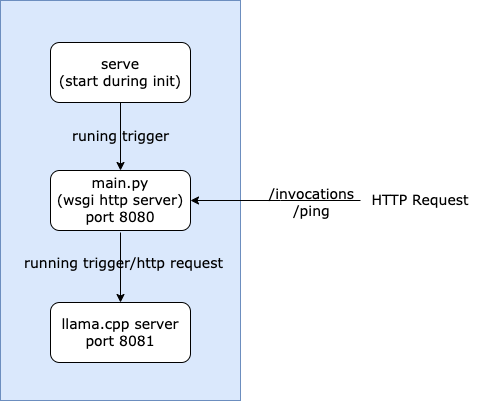

# Deploying GGUF Format LLM Model Using Amazon SageMaker

This project provides a notebook example to demonstrates how to deploy LLM models in [GGUF](https://github.com/ggerganov/ggml/blob/master/docs/gguf.md) format using Amazon SageMaker's Bring Your Own Container (BYOC) approach. By integrating [llama.cpp](https://github.com/ggerganov/llama.cpp), you can run efficient model inference services on SageMaker.

## Architecture

The solution architecture is shown in the diagram below. It consists of the following main steps:



The solution architecture is shown in the diagram. It consists of the following main steps:
1. Download the GGUF model from HuggingFace and upload it to S3. This blog will use the Llama 3 8B GGUF model as an example.

2. Prepare key files required for BYOC in the Notebook:

   ```
   workspace
   |— Dockerfile
   |— main.py
   |— requirements.txt
   |— serve
   |— server.sh
   ```

   - `Dockerfile`: Describes how to build the container, which will be based on the llama.cpp container.
   - `main.py:` A WSGI HTTP server based on the Flask framework, used to interact with llama.cpp and meet the hosting requirements of SageMaker inference nodes. It accepts POST requests sent to the `/invocations` and `/ping` endpoints, and starts server.sh to run the llama.cpp service after the model is loaded.
   - `requirements.txt`: Python-related dependencies.
   - `serve`: The entry file for SageMaker inference nodes. It starts the WSGI server of main.py and related processes using port 8080, and interacts with the llama.cpp service.
   - `server.sh`: Starts the llama.cpp server using port 8181.

   The trigger logic for its execution and HTTP request flow are shown in the diagram.

   


3. Create a custom Docker image and upload it to Amazon ECR (Elastic Container Registry).
   1. Write a Dockerfile that includes necessary dependencies (such as llama.cpp) and your GGUF model path.
   2. Build and test the Docker image.

4. Create an Amazon SageMaker Model in the Notebook and deploy it to an Inference Endpoint.
   1. During the deployment phase, the SageMaker Model will pull the ECR image that packages the llama.cpp service.
   2. During the inference endpoint runtime, it will download the GGUF model from the S3 bucket to the specified location in the container.

5. Test the endpoint by using the SageMaker SDK to request and invoke the endpoint for inference.

## Prerequisites

- A valid AWS account with appropriate permissions

- An Amazon SageMaker Notebook instance

  - Please note that it's recommended to have at least 30GB of disk space, which will be mainly used for container building, model conversion, and other related tasks.

  - When selecting or creating an IAM role, please ensure that the role has permissions to push images to Amazon ECR. This allows the Notebook to have the authority to push BYOC (Bring Your Own Container) images to the specified ECR repository. Please check the corresponding inline permissions:

    ```json
    {
        "Effect": "Allow",
        "Action": [
            "ecr:CompleteLayerUpload",
            "ecr:UploadLayerPart",
            "ecr:InitiateLayerUpload",
            "ecr:BatchCheckLayerAvailability",
            "ecr:PutImage",
            "ecr:BatchGetImage"
        ],
        "Resource": "arn:aws:ecr:*:*:*"
    }
    ```

## Deployment Guide

1. Import  `deploy-gguf-model-to-sagemaker.ipynb` file into Notebook instance and open it.
2. Modify the corresponding variables and execute each step in Notebook.

### Standard Invocation

```python
llama_args = {
    "prompt": "What are the most popular tourist attractions in Beijing?",
    "max_tokens": 512,
    "temperature": 3,
    "repeat_penalty": 10,
    "frequency_penalty": 1.1,
    "top_p": 1
}

inference = invoke_sagemaker_endpoint(endpoint_name, llama_args)
print(inference['choices'][0]['text'])
```

### Streaming Invocation

```python
python
llama_args = {
    "prompt": "What are the most popular tourist attractions in Beijing?",
    "max_tokens": 512,
    "temperature": 3,
    "repeat_penalty": 10,
    "frequency_penalty": 1.1,
    "top_p": 1,
    "stream": True
}

invoke_sagemaker_streaming_endpoint(endpoint_name, llama_args)
```

### Dynamic Model Update

You can pass S3 bucket name and object name to SageMaker inference instance to replace model files at runtime:

```python
payload = {
    "configure": {
        "bucket": S3_BUCKET_NAME,
        "key": MODEL_NAME
    }
}
response = sagemaker_runtime.invoke_endpoint(
    EndpointName=endpoint_name,
    ContentType='application/json',
    Body=json.dumps(payload)
)
print(f"response: {response}")
```

### Resource Cleanup

After testing, if you no longer need the running inference endpoint, please execute the last step in the sample notebook to delete  the created endpoint resources and avoid unnecessary costs. You can also manually delete related resources in the console, such as:

- SageMaker notebook and inference endpoints
- ECR container images
- S3 model files

## Reference

[1] https://github.com/ggerganov/ggml/blob/master/docs/gguf.md

[2] https://github.com/ggerganov/llama.cpp

[3] https://docs.aws.amazon.com/sagemaker/latest/dg/adapt-inference-container.html

[4] https://sagemaker-examples.readthedocs.io/en/latest/advanced_functionality/scikit_bring_your_own/scikit_bring_your_own.html

[5] https://github.com/aws-samples/genai-llm-cpu-sagemaker/tree/main/docker

[6] https://community.aws/content/2eazHYzSfcY9flCGKsuGjpwqq1B


## Security

See [CONTRIBUTING](CONTRIBUTING.md#security-issue-notifications) for more information.

## License

This library is licensed under MIT-0 License. See the [LICENSE](LICENSE) file.
